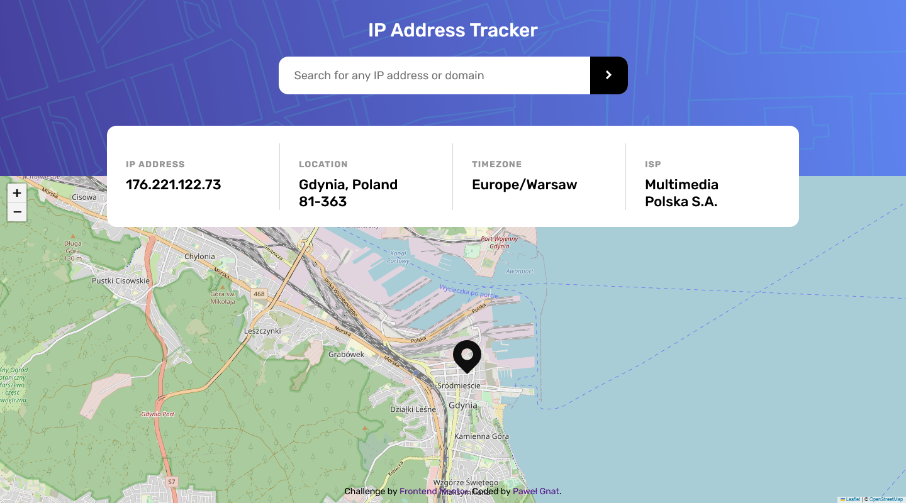

# Frontend Mentor - IP address tracker solution

This is a solution to the [IP address tracker challenge on Frontend Mentor](https://www.frontendmentor.io/challenges/ip-address-tracker-I8-0yYAH0). Frontend Mentor challenges help you improve your coding skills by building realistic projects.

## Table of contents

- [Overview](#overview)
  - [Screenshot](#screenshot)
  - [Links](#links)
- [My process](#my-process)
  - [Built with](#built-with)
  - [What I learned](#what-i-learned)
- [Author](#author)

## Overview

### Screenshot

### Links

- Live Site URL: [Frontend Mentor IP address tracker](https://pawel-gnat.github.io/Frontend-Mentor-IP-address-tracker/)

## My process

I used ip-api | pro instead of IP Geolocation API by IPify, because I found better free version. It has just free endpoint limited to 45 requests per minute. I connected 2 APIs (second is leaflet.js) by recursion.

### Built with

- Semantic HTML5 markup
- CSS custom properties
- Flexbox
- Mobile-first workflow
- JavaScript

### What I learned

I used ip-api | pro instead of IP Geolocation API by IPify, because I found better free version. I implemented very basic error handling. I did this task within 5 hours and I really enjoed it. It was clearly something else from static website examples.

## Author

- Frontend Mentor - [@Pawel-Gnat](https://www.frontendmentor.io/profile/Pawel-Gnat)
